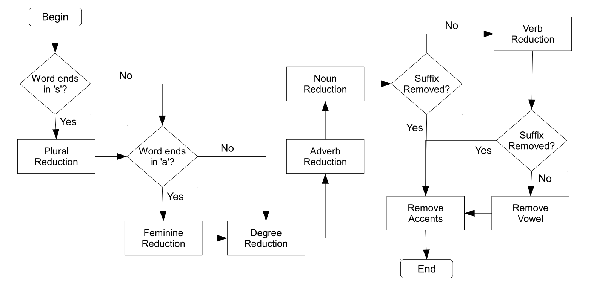

# RSLP Automata Stemmer

This projects implements the automata-based version of RSLP algorithm for apply the stemming process in words of the brazilian portuguese language.

The code was developed following the instructions described in the article [Assessing the Efficiency of Suffix Stripping Approaches for Portuguese Stemming](https://dl.acm.org/citation.cfm?id=2952670). A copy of the article can be found at the folder 'article' of this project.

## Getting Started

To use the code, just call the function apply and pass the word to be processed

```java
import stemmer.rslp.RSLPAutomata;

public class Stemming {

	public Stemming() {
		RSLPAutomata rslp = new RSLPAutomata();
		String result = rslp.apply("word-to-be-processed", RSLPAutomata.REMOVE_ACCENTS);
	}
	
}
```

### Dependencies

There is no dependencies for this project

## Graphic Interface

A graphic interface can be launched from class RSLPTestWindow (package ui). The algorithm does not needs this user interface to work, it was developed only to provided a graphic way to run and test the code.

## Documentation

### Articles

This code was written based in the article [Assessing the Efficiency of Suffix Stripping Approaches for Portuguese Stemming](article/suffix-stripping-approaches-paper.pdf). You can also find it at [https://dl.acm.org/citation.cfm?id=2952670](https://dl.acm.org/citation.cfm?id=2952670)

The suffix stripping rules used in class RSLPSuffixStrippingRules were obtained in the article [A Stemming Algorithm for the Portuguese Language](https://ieeexplore.ieee.org/document/989755/)

The exception lists used in class RSLPException were obtained in the monograph [Stemming para a língua portuguesa: estudo, análise e melhoria do algoritmo RSLP](https://lume.ufrgs.br/handle/10183/23576)

### Visual representation of the algorithm


A pdf file explaining the working of the algorithms described in the article can be found [here](article/suffix-stripping-approaches-presentation.pdf)

The original RSLP algorithm (the automata-based version implemented in this project follows the same algorithm) is presented bellow.



A series of images (.png) describing each part of the algorithm can be found at the folder 'automatas' of this project. The automatas images can be generate with the software [Graphviz](http://graphviz.org/) with the *.gv files.